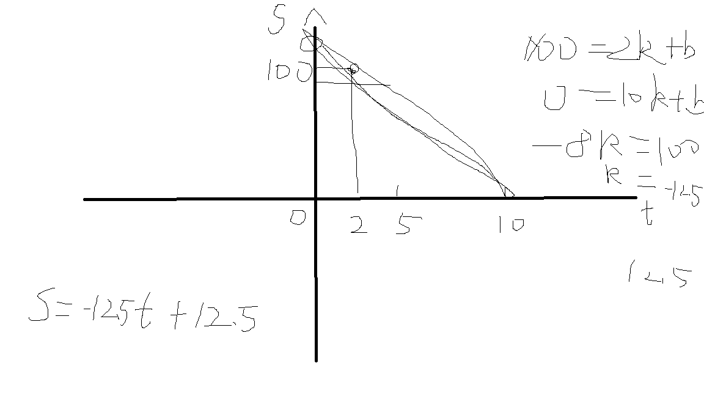

#	作业思路
##	Feature
1.	实现了一百以内的加减乘除运算
2.	支持用户自定义题目数量和游戏难度及最大生成范围
3.	支持对用户所有输入做合法性检查的功能
4.	具备历史记录，并打印最终结果与用时情况
5.	新增了计分功能，综合考虑答题时间与正确回答占比

##	实现思路
1.	build_asignment():  
随机生成符合计算规则的计算题
2.	deal_user_input():  
被重载了一次
一个面向题目，来处理题目相关的设置（如难度、最大生成范围）
一个面向回答，处理用户输入的答案，并记录用时
3.	check_cin():
处理用户的非法输入，返回合法的输入
4.	check_user_answer():   
检查答案是否正确，并记录
5.	show_result():  
根据答题情况计算最终得分，并打印最终结果
6.	history结构体:  
历史记录，保存每个问题答题情况
7.	计分规则如下：
用时得分 = -12.5 * 平均用时 + 125	
正确率得分 = 100 / 题目数量 * 正确回答数
总分 = 用时得分 * 0.3 +  正确率得分 * 0.7
其中用时计分为实现小于2s时满分用了if语句做判断实现，具体用时得分关系如下图所示

#	编译环境
1.	Windows10 下使用Microsoft Visual Studio Community 2019 集成开发环境
采用ISO C++14 Standard编译通过
2.	Ubuntu20.04 下使用g++ 9.4.0版本
采用c++11、c++14、c++17、c++2a Standard编译通过

#	运行截图

