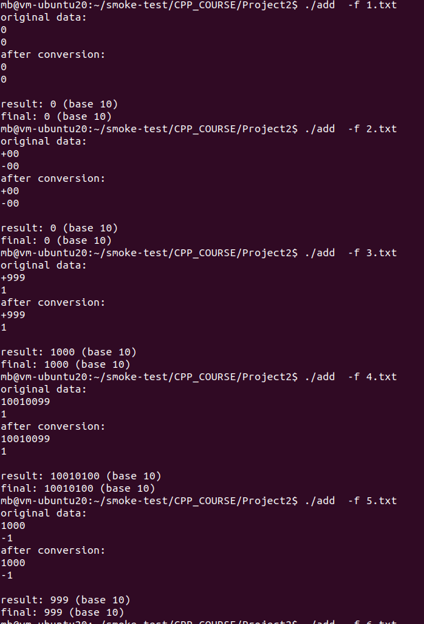

<!--
 * @Author: masterb 546786003@qq.com
 * @Date: 2022-08-16 20:54:30
 * @LastEditors: masterb 546786003@qq.com
 * @LastEditTime: 2022-08-21 14:31:32
 * @FilePath: \flowe:\git\Project2\readme.md
 * @Description: 
 * 
 * Copyright (c) 2022 by masterb 546786003@qq.com, All Rights Reserved. 
-->
#	作业思路
##	Feature
1.	实现了长整数加法
2.	支持2-36进制的输入，并具备输入的合法性检测
3.	支持自定义进制输出
4.  良好的交互提示

##	实现思路
长加法的实现思路主要分三步，如下图所示：

1.  逐位做加法运算
2.  根据临时结果处理标志位
3.  将临时结果添加到最终结果里

进制转换
1.  输入进制的转换借助作业提示里的1*400 + 10*20 +3 =603实现
2.  输出进制借助短除法取余实现

#	编译环境
1.  Ubuntu20.04 下使用g++ 9.4.0版本
采用c++11、c++14、c++17、c++2a Standard编译通过
2.  windows下因为由于没有unistd.h头文件未编译成功

#	运行截图

