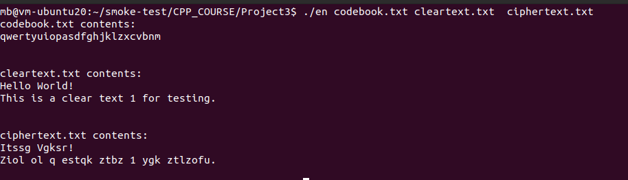

#	作业思路
##	Feature
1.	实现了简单文件加密解密系统

##	实现思路
加密主要分三步：
1.  读取码本文件，用std::map构建编码映射
2.  读取明文文件，使用encrypt_txt()函数实现加密
3.  将加密结果写入到文件

同样解密也是三步：
1.  读取码本文件
2.  读取密文文件，使用decrypt_txt()函数实现解密
3.  将加密结果写入到文件

关于二进制加密（尚未实现）：
目前仅通过build_bin_book.cpp生成了255到0的二进制码本，可以通过二进制方式读取文件，但在build_binmap()函数生成二进制编码映射时遇到了core dump的错误。

#	编译环境
Ubuntu20.04 下使用g++ 9.4.0版本
采用c++11、c++14、c++17、c++2a Standard编译通过

#	运行截图

