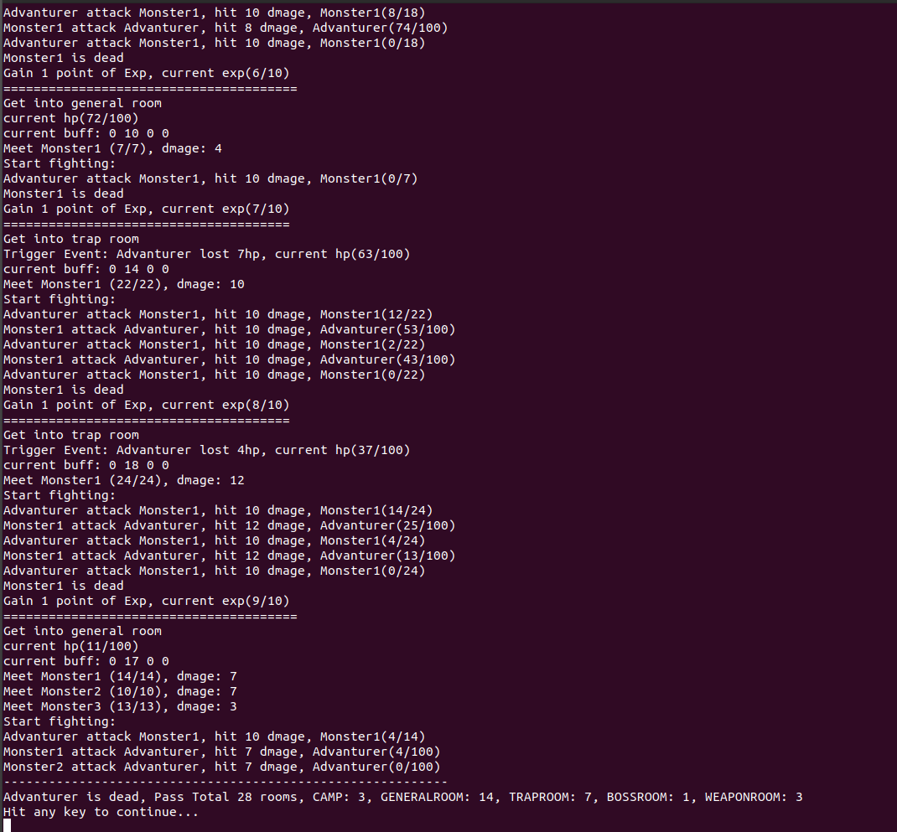

#	作业思路
##	Feature
1.	实现了基础部分所有功能
2. 	实现了扩展一部分

##	实现思路
1.  首先是基类实现，房间与角色于common.h头文件中定义
2.  然后是继承类，探险家怪兽与各房间具体实现分别于advanturer.h，room.h，monster.h中定义
3.  在project4.cpp主程序中创建并调用这些类方法

#	编译环境
Ubuntu20.04 下使用g++ 9.4.0版本
采用c++11、c++14、c++17、c++2a Standard编译通过

#	运行截图

